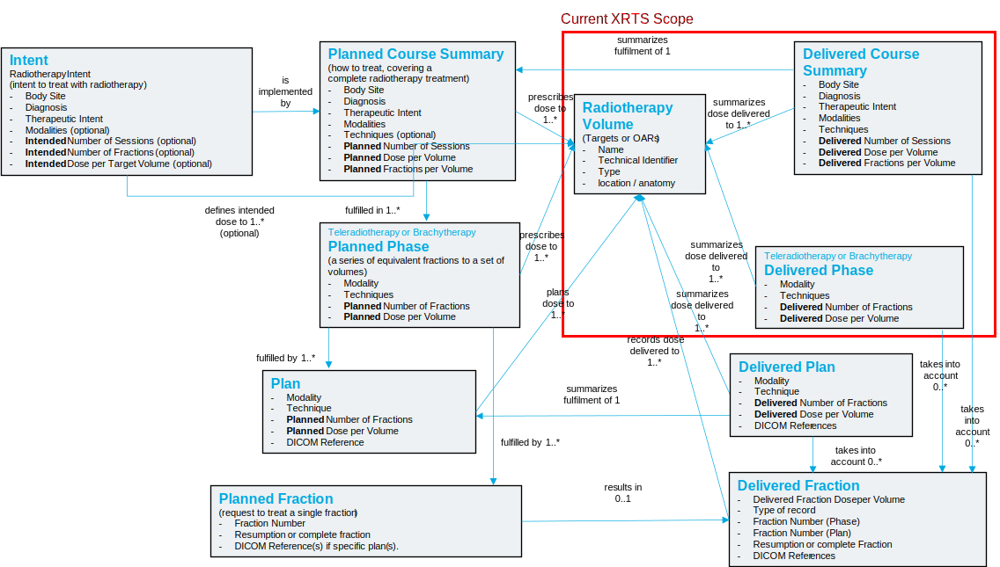

# Status
This repository is outdated. 

The current assumption is that the IHE-RO XRTS supplement can directly reference the CodeX RT FHIR IG.

Repo at https://github.com/HL7/codex-radiation-therapy

Published to a temporary location here 
http://build.fhir.org/ig/HL7/codex-radiation-therapy/branches/master/index.html

For questions and comments, please contact [Martin von Siebenthal](mailto:martin.vonsiebenthal@varian.com).

If it turns out that an IHE profile is need on top of CodeX RT again, this IG here will be updated accordingly.

A temporary published build is here http://build.fhir.org/ig/IHE/RO.XRTS/branches/master/index.html

Please see the artifacts at http://build.fhir.org/ig/IHE/RO.XRTS/branches/master/artifacts.html.

The rest is mostly still template text. 

See working version of the Word document for more contents on use cases, transactions, etc. 
[IHE RO Technical Framework Supplement for XRTS, working version](https://www.dropbox.com/sh/vfndrz3nasdajb8/AACEtz2zGLgJ4HzFly_Rsc6Ya?dl=0)

# Overall organization

## Volume 1: Use-Case Analysis
This section contains the Use-Case Analysis and breakdown into Actors, Transactions, Options, and Grouping 

## Volume 2: Transactions
When a Supplement defines transactions they will be defined in Volume 2. A Transaction is given a unique identifier with the form <domain>'-'<number>. Where this is assigned by the domain committee. The unique number does not need to appear anywhere in the network transaction, but sometimes it is useful.

Transactions are made up of 1 or more messages. Each Message is made up of a Trigger, Message Encoding, and Expected Actions. 

The Transaction might define vocabulary, security-considerations, or other transaction specific artifacts.

For FHIR the Message Encoding is usually defined by one or more StructureDefinition profiles

## Volume 3: Content
When a Supplement defines transaction independent content they will be defined in Volume 3. Such examples as CDA Documents, FHIR Documents, XDW Workflows, etc.

The content binding to transactions might require definitions of things like Document Sharing Metadata.

The XDS Metadata model and encoding into eb-Reg and into FHIR are an example.

## Volume 4: National Extensions
No national extensions at this point.

## Volume 5: Artifacts
When computable constraint definitions (e.g. StructureDefinition, CapabilityStatement, etc) are defined they will appear in Volume 5. This Volume is automatically created by the Implementation Guide publisher.

References to these artifacts is encouraged in the other portions of the Implementation Guide.

## Volume 6: Test Plan
The Test Plan should be defined for all Implementation Guides. It must minimally define the overall intended plan for testing. This plan may define scenarios using ExampleScenario or Cucumber. This plan should be broken down into unit tests (usually leveraging StructureDefinition validation), and Integration tests (which test a set of steps among multiple actors). 

# Mapping structure to IG

TODO fill in mapping of the above concepts to the supplement template recommended menu and file structure

